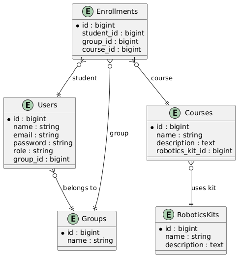

# Robotics School Project

##  Project Description
This project is a management system for a robotics school.  
It allows administrators to manage users, groups, courses, robotics kits, and student enrollments.

## Entity-Relationship Model
The database schema includes the following entities:

- **Users** → belong to a group and can enroll in courses.
- **Groups** → organize users into teams or classes.
- **Courses** → each course uses a robotics kit.
- **RoboticsKits** → available kits for courses.
- **Enrollments** → connect students with courses and groups.

